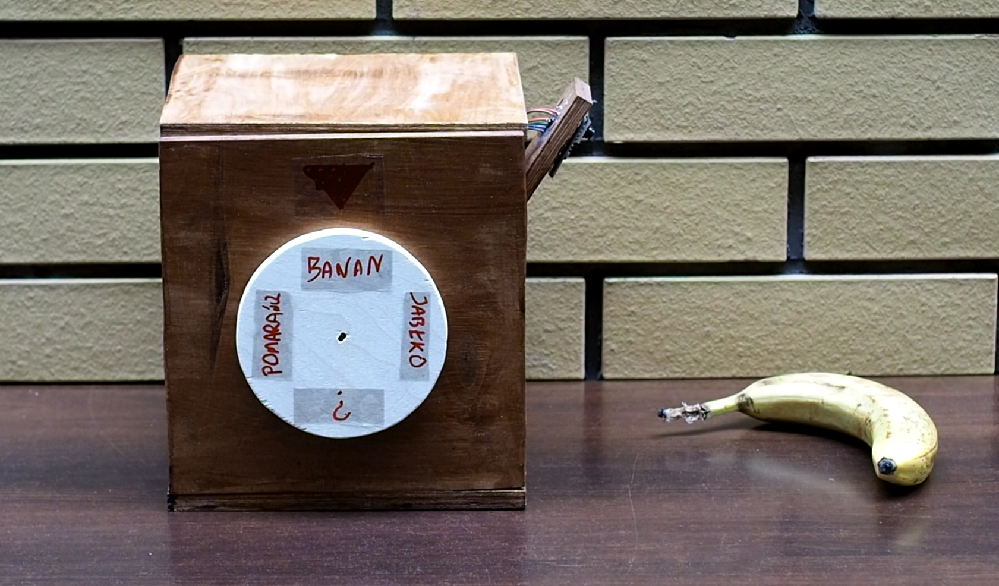
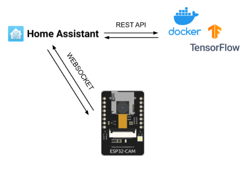
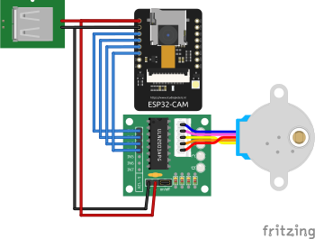

# Object Detector



## Description

A uni project to detect objects using image classification. What you see above is a box with a WiFi camera module and a motorized dial to show the most likely prediction.

Since our budget for this amazing contraption was whole 15 euros, we couldn't afford a proper server and instead hacked together a solution using an existing [Home Assistant](https://www.home-assistant.io/) instance already exposed to the internet.



## How does it work

The ESP-CAM module periodically captures an image and sends it to a Home Assistant instance, which forwards it to an API running MobileNet image classification model. The server returns a list of predictions (detected objects) which is then used by ESP to move the dial to the correct position.

## Part list

- ESP-CAM module
- 28BYJ-48 5V stepper motor
- ULN2003 stepper motor driver
- Stripped USB-A cable
- An amazing DIY wooden case as seen above

## Wiring diagram



## Folders in this repository

- `esp32-ai-server` - Docker container doing the actual AI TensorFlow magic
- `pyscript` - Contains a custom script for Home Assistant that relays communication between ESP and API server
- `object_detector` - Arduino sketch running on the ESP that captures images, communicates with API and moves the motor
  - Note: `Base64.cpp` and `Base64.h` files are copied here from an older version of the [adamvr/arduino-base64](https://github.com/adamvr/arduino-base64) library to fix compilation problems (see [this issue](https://github.com/adamvr/arduino-base64/issues/18))

## Installation

1. Install [PyScript](https://github.com/custom-components/pyscript) in Home Assistant and copy the `pyscript` folder from this repository into your HA configuration folder
1. Setup the API server container, you can use the following docker-compose configuration:
   ```yaml
   esp32-ai-server:
     container_name: esp32-ai-server
     build: "./esp32-ai-server"
     ports:
       - "2137:2137"
     restart: unless-stopped
   ```
1. Replace the ip address in `pyscript/esp32_ai.py` with the ip of your container
1. Generate a [Long lived access token](https://developers.home-assistant.io/docs/auth_api/#long-lived-access-token) in Home Assistant
1. Replace values inside `object_detector/SecretsExample.h` and rename it to `Secrets.h`
1. Download necessary libraries using Arduino Library Manager, compile the project and flash the ESP-CAM module
